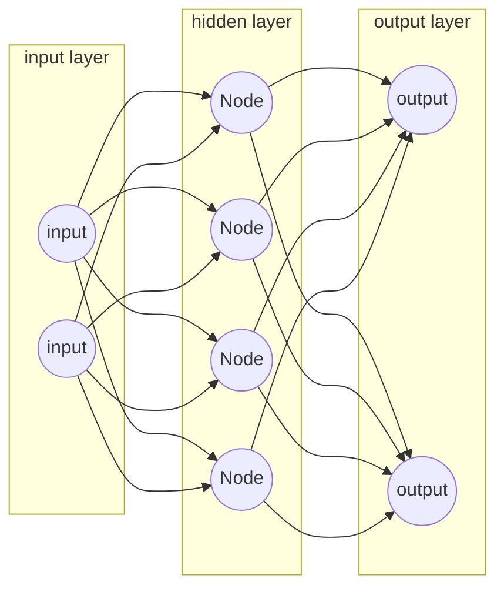

# best-simple-neural-network

This is a Javascript module that provides a simple neural network and some utility functions to get your machine-learning project started. No dependencies or external tools required!
## Installation
### Manual
Clone or/and download this repository. Then import from the index.js file.
```bash
import NeuralNetwork from "./best-simple-neural-network/index.js"
```
This imports a class, that contains everything you need.
### npm
cd to your project directory, and type the following command in your terminal:
```bash
npm i best-simple-neural-network
```
You can either require the neural network with commonjs:
```javascript
const NeuralNetwork = require("best-simple-neural-network").default;
```
Don't forget the `.default` at the end, when you do that.

----
Or you import via ES6:
```javascript
import NeuralNetwork from "best-simple-neural-network";
```
In that case, don't forget to add `"type": "module"` to your package.json.

## Getting started
Let's start with the most important functions:
```javascript
const NeuralNetwork = require('simple-neural-network').default;

const nn = new NeuralNetwork(2, 2, 1, 4);

console.log(nn.info);
console.log(nn.nodes);

const input = [2, -12] //Array with two arbitrary numbers
const result = nn.fire(input);
console.log(result);
```
**Walkthrough**

`const nn = new NeuralNetwork(2, 2, 1, 4)` This creates a new neural network instance.
The first argument is the amount of input nodes. Here we chose 2, so the first layer has two nodes.
The second argument is the amount of output nodes in the last layer.
The third argument is the amount of hidden layers, between the input layer and the output layer. We chose 1, so in total the neural network will have 3 layers: 1 input, 1 hidden, 1 output.
The fourth argument is the amount of nodes per hidden layer. 
So our freshly created neural network looks like that:


The constructor also takes a fifth and a sixth (optional) argument. You can provide functions to seed the weights and the biases. By default, it seeds with a random number between -1 and 1.

`nn.info` Is a string with the most important info about this particular instance. It is created at instanciation and doesn't change after that. Keep that in mind.

`nn.nodes` Is the most important property! It contains the actual network. `.nodes` is a 2D array, containing each of your networks layers as an array. Each of those layer-arrays contain objects, which represent the nodes of your neuronal network.
The node-objects look like this:
```javascript
{
	bias: <number>,
	edges: <Array<Edge>>
}
```
The `edges` array contains edge-objects. Similar to the aforementioned node-objects, an edge has only two properties:
```javascript
{
	weight: <number>,
	nextNode: <Node>
}
```
`nextNode` points to a node-object in the next layer. By default every node in each layer is connected to every node in the next layer. If you want to do any edits, you have to do them manually. Keep in mind that the provided activation chain may break, if you add cross-connections, so you must provide your own function for that.

`nn.fire(<Array>)` invokes the activation chain. You must provide a numbers-array with an equal length as your input layer. In the example we provide two numbers, since we have two input nodes.
It returns an array with the length of the output layer, containing the resulting values of all operations.
The activation-chain is very classical. Input * Bias gets forwarded through each edge, the receiving node adds its bias to the sum, applies an activation function, and the process repeats until the last layer.
The neuronal network class comes with a couple activation functions, that can be applied to each result of each node. Be default it uses the rectified linear unit function, that is commonly used in machine learning. More info in the documentation.
By default, all values in the output layer get fed into a softmax activation function, which normalizes the results, so that every number coming from the output layer, adds up to 1.
You can turn that off by setting `nn.finalOperation = null`.

## Documentation
### Constructor Function
```javascript
import NeuralNetwork from "./best-simple-neural-network/index.js";

new NeuralNetwork(
	amountOfInputNodes <Integer>,
	amountOfOutputNodes <Integer>,
	amountOfHiddenLayers <Integer>,
	amountOfNodesPerHiddenLayer <Integer>,
	weightGenerator <Function> (Optional),
	biasGenerator <Function> (Optional)
)

//Example that seeds all weights and biases as 1:

function seed(){
	return 1;
}
new NeuralNetwork(2,4,6,8,seed, seed)
```
### Utility Functions
`NeuralNetwork.randomNumberBetween(min<Integer>, max<Integer>)` Returns a random integer number between min and max arguments.
`NeuralNetwork.randomFloatBetween(min<Integer>, max<Integer>)` Returns a random floating point number between min and max arguments.

----
`NeuralNetwork.reLU(<number>)` Returns either 0 or the input number if > 0.
`NeuralNetwork.leakyReLU(<number>)` Returns either the input number, or the input number * 00.1, if < 0;
`NeuralNetwork.sigmoid(<number>)` Applies sigmoid function on input number and returns a number between -1 and 1.
`NeuralNetwork.tanh(<number>)` Applies tanh on input number and returns the result.

----
`NeuralNetwork.softmax(number[])` Takes an array of numbers as input. Returns an array of numbers that add up to 1 in total. By default it's the final function of the activation chain in your neural network instance.
`NeuralNetwork.rotateMatrix(<Array<Array>>)` Takes a 2D array. Returns a 2D array rotated by 90 degrees.
```javascript
NeuralNetwork.rotateMatrix(
	[
		[ 1, 2, 3],
		[4, 5, 6],
		[7, 8, 9]
	]
)
/*Returns:
[ 
	[ 1, 4, 7 ], 
	[ 2, 5, 8 ], 
	[ 3, 6, 9 ]
]*/
```
### Neural Network Instance Properties
`.nodes` The actual data of your neural network. If you want to make changes by hand, you do it here. See "**getting started**".
`.info` String with some meta information from instanciation time.
`.neuronActivationFunction(<number>)` The activation function applied to every node during forward propagation, to get a non linear result. By default it's reLU, but you can assign your own, or use one of the utility functions.
```javascript
const nn = new NeuralNetwork(2,2,2,2)
nn.neuronActivationFunction = NeuralNetwork.sigmoid //Assign your own activation function
```
`.returnBiases()` Returns all biases in a 2D array.
`.returnWeights()` Returns a 3D array with the weights of all edges in the neural network. The first dimension represents the layer, the second the neurons in that layer, the third the edges of each neuron.
`.fire(number[])` Takes an array with numbers. Returns an array with numbers. Executes the neural network. Relevant properties for configuration are `.neuronActivationFunction` and `.finalOperation`.
`.finalOperation(number[])` Can be a function or `null`. Takes the output of the hidden layer as an array, and returns whatever the set function returns. If set to `null`, `.fire()` will return the raw output of your output layer. By default it is set to the softmax activation function (see utility section).
`.iterateEachNode(<function(<Node>))` Takes a custom function as an argument. Iterates through each node in each layer and executes your provided function. The node gets provided to your functions first argument.